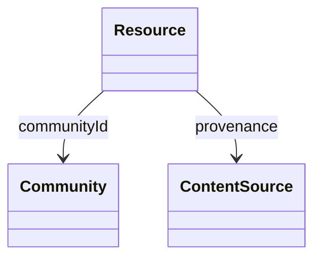

# UML — Domain Model

*Entities and their relationships. See [../01-domain-model.md](../01-domain-model.md).*

> NOTE: The shared-characteristics concept (`KnowledgeObject`) is **conceptual** —
> do not draw it as a committed superclass. Represent shared characteristics
> without presuming inheritance until that decision is made.

> TODO: Replace the stub with the full class diagram and add a caption.
