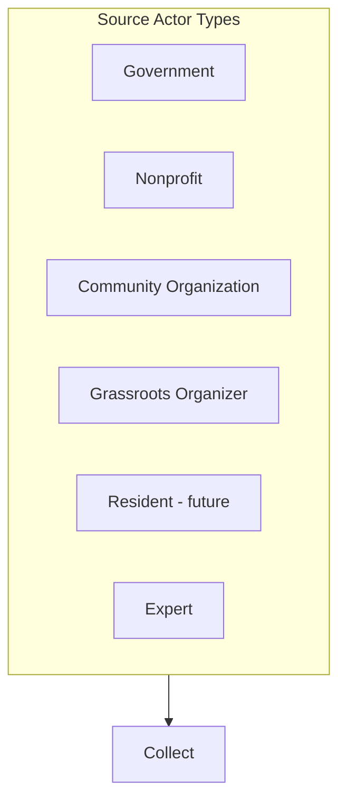

# UML — Information Sources

*Taxonomy of source actor types that feed the **Collect** stage.*
*See [../02-information-flow.md](../02-information-flow.md).*

Actor types: **Government**, **Nonprofit**, **Community Organization**,
**Grassroots Organizer**, **Resident** (future), **Expert**.

> TODO: Replace the stub with the full sources diagram and add a caption.
