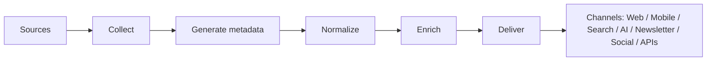

# UML — Information Flow

*The Collect → Generate metadata → Normalize → Enrich → Deliver pipeline.*
*See [../02-information-flow.md](../02-information-flow.md).*

> TODO: Replace the stub with the full flow diagram and add a caption.

